# Jarkom-Modul-1-E17-2023

## Soal 1
User melakukan berbagai aktivitas dengan menggunakan protokol FTP. Salah satunya adalah mengunggah suatu file.
### a. Berapakah sequence number (raw) pada packet yang menunjukkan aktivitas tersebut?
- Cara Pengerjaan
    - Gunakan keyword "ftp" sebagai display filter
    - Cari aktivitas yang mencurigakan. Sebenarnya disini saya coba-coba karena ada 2 yang menurut saya mencurigakan, yaitu request mp4 dan request file zip. Saya memilih request file zip karena request commandnya tidak dipakai di paket manapun.
    - Kemudian lihat di poin Transmission Control Protocol di kolom Packet Detail. Kemudian lihat di bagian Sequence number (raw)
    - Ambil angkanya kemudian masukkan di terminal
- Screenshoot 
    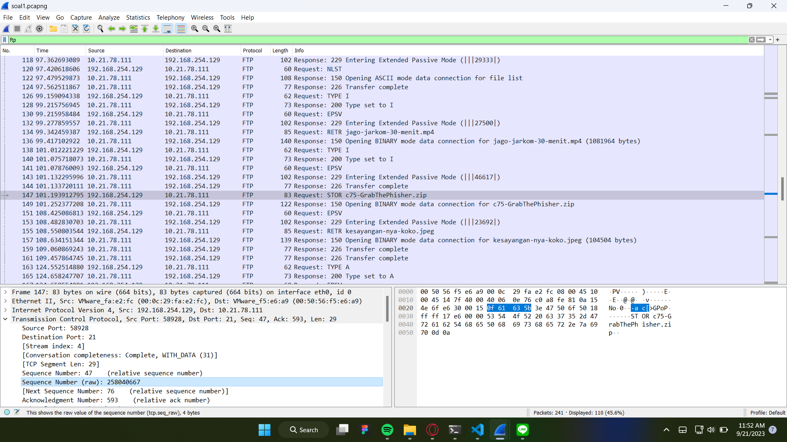
    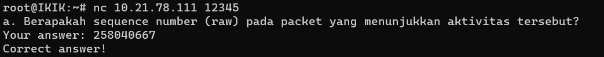
- Kendala
    </br>Clue yg diberikan hanya melakukan berbagai aktivitas, jadi saya pikir itu bentuk salah satu command yang bakal kepake di beberapa paket. Tapi karena paketnya sedikit dan mudah untuk dicek satu-satu, akhirnya saya menemukan paket yang berbeda

### b. Berapakah acknowledge number (raw) pada packet yang menunjukkan aktivitas tersebut?
- Cara Pengerjaan
    - Masih berada di paket yang sama
    - Lihat acknowledge number (raw) di baris selanjutnya
    - Ambil angkanya kemudian masukkan di terminal
- Screenshoot 
    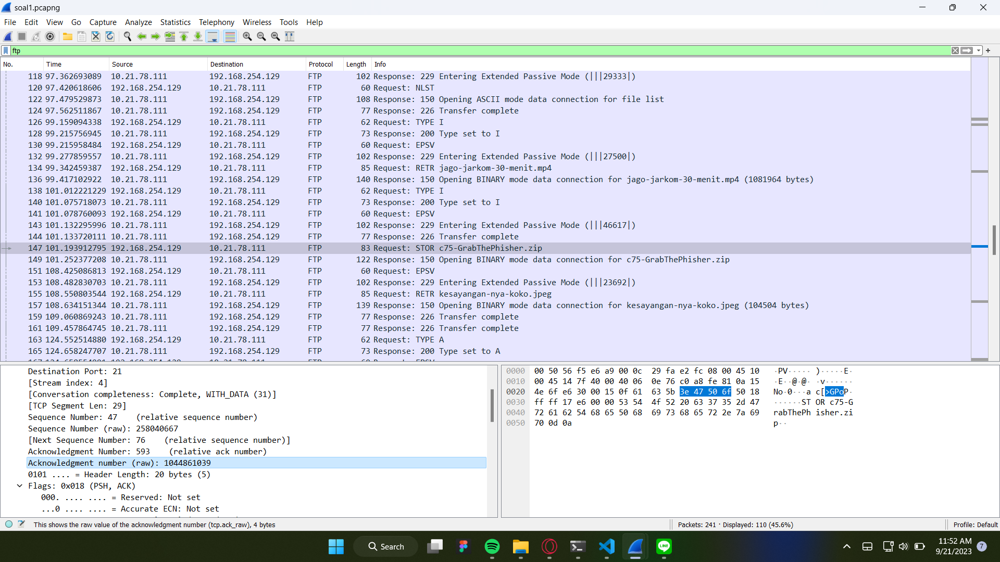
    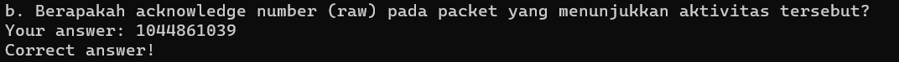
- Kendala
    </br> tidak ada

### c. Berapakah sequence number (raw) pada packet yang menunjukkan response dari aktivitas tersebut?
- Cara Pengerjaan
    - Pilih paket yang sama
    - Kemudian follow TCP stream
    - Pilih paket yang berisi respons untuk membuka zip tersebutt
    - Lihat sequence number (raw) di Packet Detail
    - Ambil angkanya kemudian masukkan di terminal
- Screenshoot 
    
    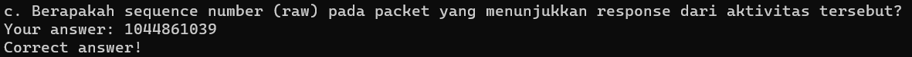
- Kendala
   </br> Tidak ada 

### d. Berapakah acknowledge number (raw) pada packet yang menunjukkan response dari aktivitas tersebut?
- Cara Pengerjaan
    - Masih berada di paket yang sama
    - Lihat acknowledge number (raw) di baris selanjutnya
    - Ambil angkanya kemudian masukkan di terminal
- Screenshoot 
    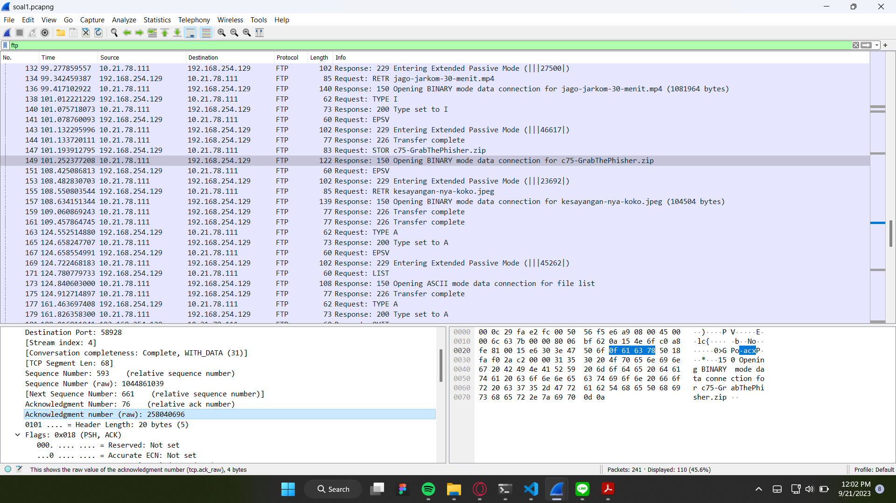
    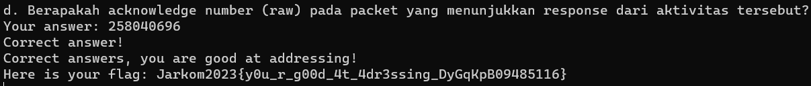
- Kendala
    </br> Tidak ada 


## Soal 2
Sebutkan web server yang digunakan pada portal praktikum Jaringan Komputer!
- Cara Pengerjaan
    - Cari IP Address dari platform praktikum jarkom. Diperoleh IP Addressnya adalah ```http://10.21.78.111``` di port ```8000```
    - Kemudian, pasang display filter ```ip.addr == 10.21.78.111``` dan ```http```
    - Cari Server di kolom Hypertext Transfer Protocol di bagian Packet Details
    - Masukkan Web Server ke dalam terminal
- Screenshoot 
    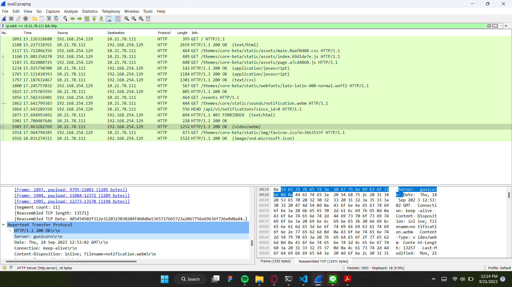
    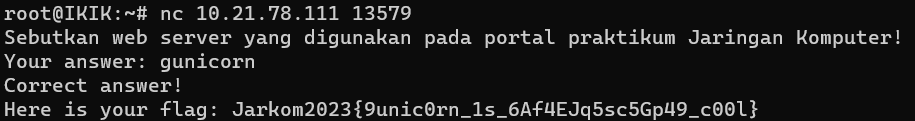
- Kendala
    </br> Tidak Ada


## Soal 3
Dapin sedang belajar analisis jaringan. Bantulah Dapin untuk mengerjakan soal berikut:
### a. Berapa banyak paket yang tercapture dengan IP source maupun destination address adalah 239.255.255.250 dengan port 3702?
- Cara Pengerjaan
- Screenshoot 
- Kendala

### b. Protokol layer transport apa yang digunakan?
- Cara Pengerjaan
- Screenshoot 
- Kendala


## Soal 4
Berapa nilai checksum yang didapat dari header pada paket nomor 130?
- Cara Pengerjaan
- Screenshoot 
- Kendala


## Soal 5
Elshe menemukan suatu file packet capture yang menarik. Bantulah Elshe untuk menganalisis file packet capture tersebut.
### a. Berapa banyak packet yang berhasil di capture dari file pcap tersebut?
- Cara Pengerjaan
    - Terapkan display filter ```smtp``` untuk menyaring protokol pengiriman email di Wireshark
    - Kemudian saya mencari manual langsung di bagian ```DATA```, karena yang sebelumnya masih berupa autentikasi
    - Lalu lihat ```Line-based text data```, cari sebuah password untuk membuka file zip yang diberikan soal
    - Karena password yang diberi masih berupa base64, maka perlu di decode menjadi string biasa. Disini saya menggunakan converter online
    - Kemudian masukkan password tersebut kedalam file zip yang terkunci
    - Buka file ```connect.txt``` dan masukkan nc addressnya
    - Kembali ke aplikasi Wireshark. Kemudian lihat total paket di pojok kanan bawah
    - Masukkan angka tersebut ke dalam terminal
- Screenshoot 
    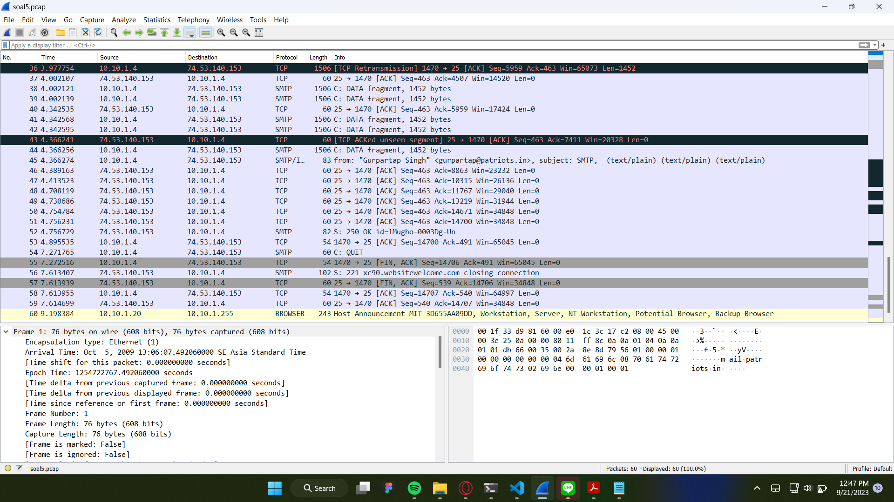
    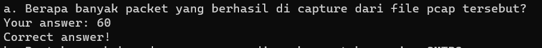
- Kendala
    </br>

### b. Port berapakah pada server yang digunakan untuk service SMTP?
- Cara Pengerjaan
    - Masih berada di paket poin a
    - Lihat ```Destination Port``` di kolom Transmission Control Protocol
    - Masukkan angka tersebut ke dalam terminal
- Screenshoot 
    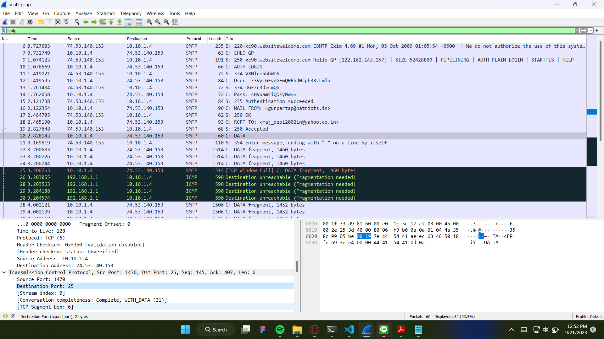
    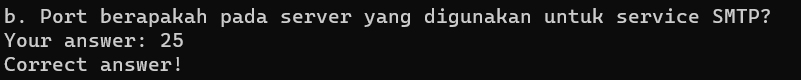
- Kendala
    </br> Tidak ada

### c. Dari semua alamat IP yang tercapture, IP berapakah yang merupakan public IP?
- Cara Pengerjaan
    - Masih berada di paket poin a
    - Lihat ```Destination Address``` di kolom ```Internet Protocol Version 4```
    - Masukkan address ke dalam terminal
- Screenshoot
    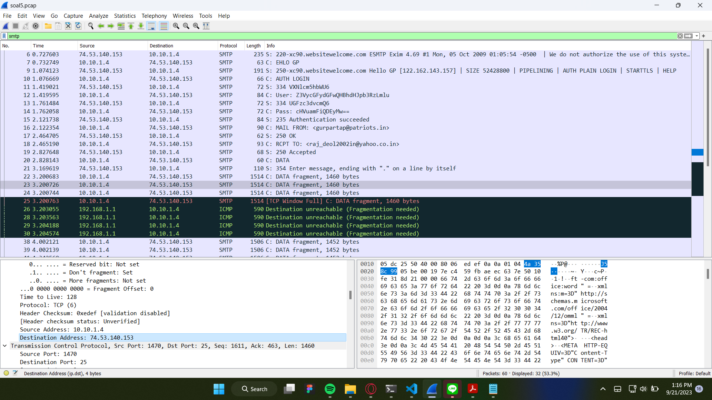
    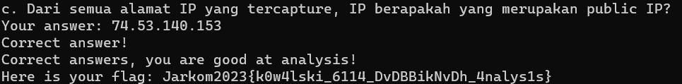
- Kendala
    </br> Tidak ada


## Soal 6
Seorang anak bernama Udin Berteman dengan SlameT yang merupakan seorang penggemar film detektif. sebagai teman yang baik, Ia selalu mengajak slamet untuk bermain valoranT bersama. suatu malam, terjadi sebuah hal yang tak terdUga. ketika udin mereka membuka game tersebut, laptop udin menunjukkan sebuah field text dan Sebuah kode Invalid bertuliskan **"server SOURCE ADDRESS 7812 is invalid"**. ketika ditelusuri di google, hasil pencarian hanya menampilkan a1 e5 u21. jiwa detektif slamet pun bergejolak. bantulah udin dan slamet untuk menemukan solusi kode error tersebut.
- Cara Pengerjaan
- Screenshoot 
- Kendala


## Soal 7
Berapa jumlah packet yang menuju IP 184.87.193.88?
- Cara Pengerjaan
- Screenshoot 
- Kendala


## Soal 8
Berikan kueri filter sehingga wireshark hanya mengambil semua protokol paket yang menuju port 80! (Jika terdapat lebih dari 1 port, maka urutkan sesuai dengan abjad)
- Cara Pengerjaan
- Screenshoot 
- Kendala


## Soal 9
Berikan kueri filter sehingga wireshark hanya mengambil paket yang berasal dari alamat 10.51.40.1 tetapi tidak menuju ke alamat 10.39.55.34!
- Cara Pengerjaan
    - Mengambil paket yang berasal dari alamat 10.51.40.1 berarti kueri yang terbentuk adalah ```ip.src == 10.51.40.1```
    - Tetapi tidak menuju ke alamat 10.39.55.34, berarti menggunakan ip destination selain alamat 10.39.55.34 dengan ip source yang sama. Hasil kueri yang terbentu adalah ```ip.src == 10.51.40.1 && ip.dst != 10.39.55.34```
- Screenshoot 
    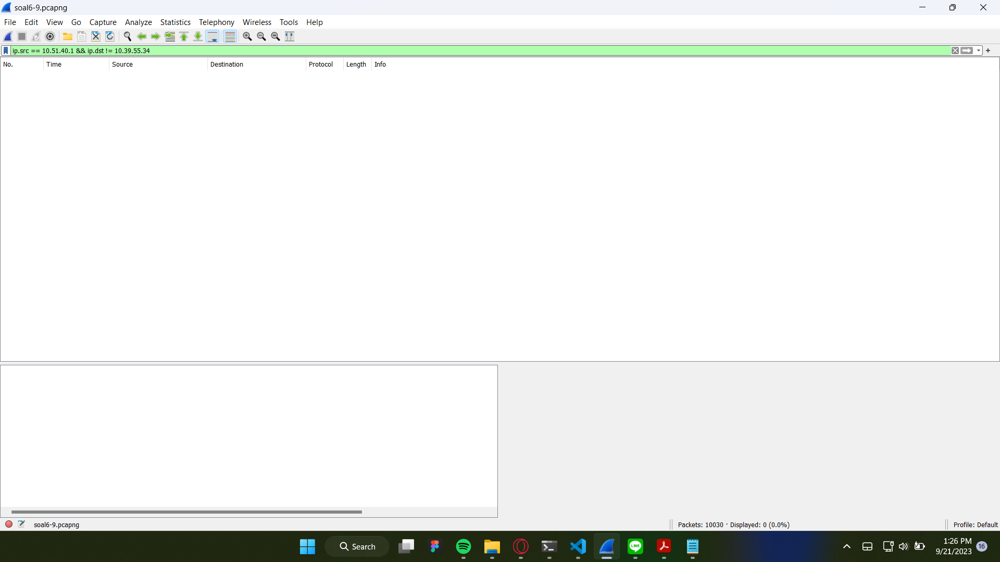
    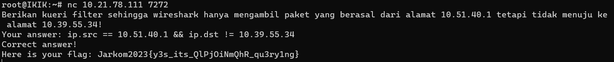
- Kendala
    </br> Tidak ada


## Soal 10
Sebutkan kredensial yang benar ketika user mencoba login menggunakan Telnet
- Cara Pengerjaan
    - Dalam pengerjaan nomor ini saya agak brute force dalam pencarian username dan passwordnya. Disini saya mencari paket yang berpotensi memiliki kredensial login.
    - Kemudian follow tcp stream
    - Cari tulisan Login beserta Passwordnya
    - Untuk Usernamenya, ikuti warna dari tulisan login. Karena tulisan loginnya berwarna biru, maka huruf yang dipakai adalah huruf yang berwarna biru
- Screenshoot 
    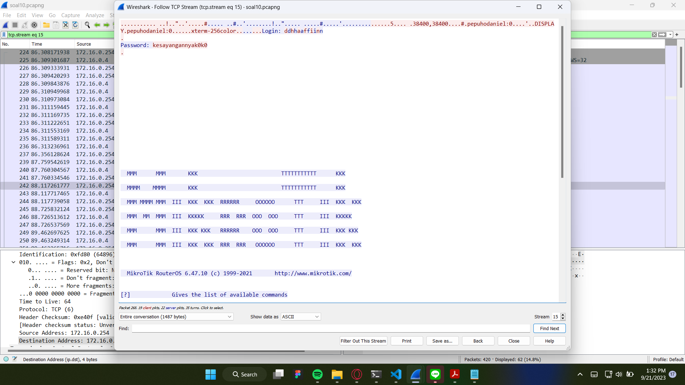
    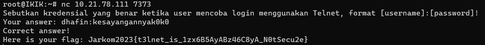
- Kendala
    </br> Diawal saya kesulitan karena pada username terdapat huruf yang dobel, sehingga ketika saya mencoba masukkan ke dalam terminal ternyata tidak bisa. Lalu saya menyadari kalau disitu ada 2 jenis warna, jadi saya mencoba memakai salah satu warna dan kemudian bisa:)